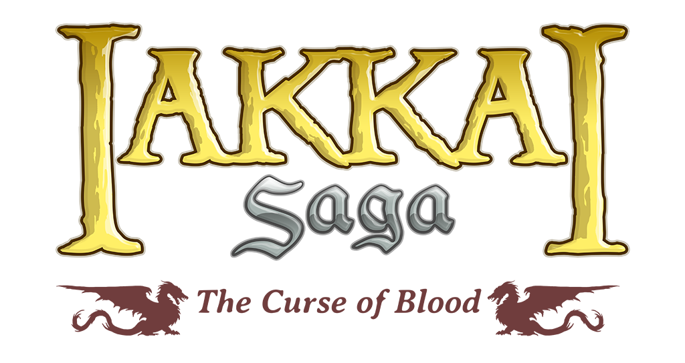

<strong>Welcome adventurer!</strong> You are about to embark in the world of Iakkai. It is a world of magic and ancient lore

<i>The Curse of Blood</i> is the first episode of the Interactive Fiction series "The Iakkai Saga", powered by the <a href="https://github.com/boken-engine/boken-engine">Boken Engine</a> framework

&nbsp;
&nbsp;
&nbsp;

  

In this first episode, you will guide a brave fighter in a quest to solve the story of the Wolfswood Village, in an adventure of mystery, action and thrilling revelations.

&nbsp;
&nbsp;
&nbsp

Feel free to download the XCode project and create your own version of the story, using all the feature offered by the <a href="https://github.com/boken-engine/boken-engine">Boken Engine</a> framework.
